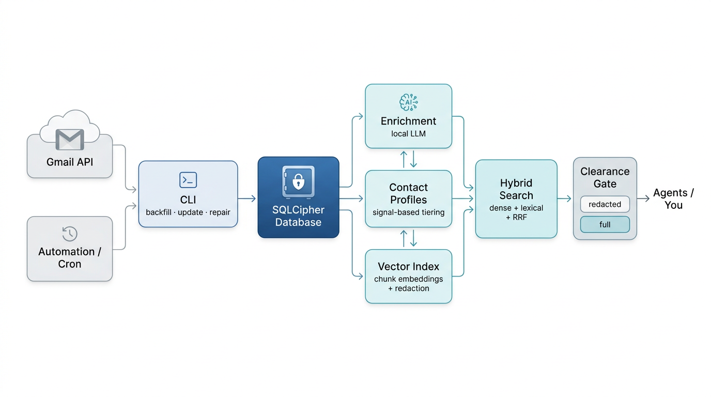
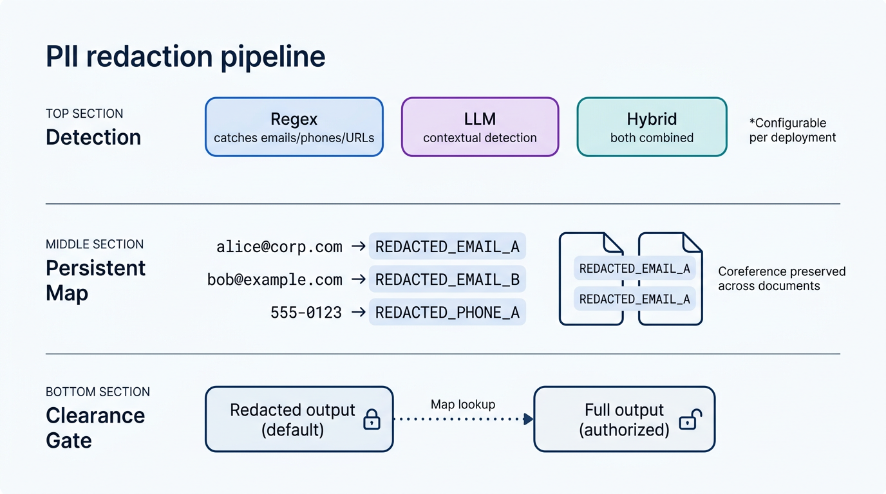

# Inbox Vault

[](https://github.com/sveinnpalsson/inbox-vault/actions)

[](LICENSE)

**A privacy firewall between your email and AI agents.**

Inbox Vault syncs Gmail into a local SQLCipher-encrypted database, redacts PII automatically, builds searchable contact profiles, and exposes a clearance-gated CLI that agents can query safely. Everything runs locally.

## Why

AI agents are increasingly useful for email triage, search, and contact management. The missing piece is a controlled data layer -- messages encrypted at rest, PII stripped before anything leaves the pipeline, access granularity built in from the start.

Inbox Vault is that layer. Originally built for a single real inbox, now packaged for reuse by anyone running [OpenClaw](https://github.com/openclaw) or similar local agent setups.

## Architecture



The pipeline has clear stages: **sync** (Gmail API to encrypted DB), **process** (enrichment, profiles, vector indexing), and **query** (hybrid search through a clearance gate). Each stage is idempotent and independently runnable.

## What it does

- **Syncs Gmail** into a local SQLCipher-encrypted database (`update`, `update --backfill`, `repair`)
- **Enriches messages** with a local LLM -- category, importance, action items, summaries
- **Redacts PII** through three configurable modes: regex patterns, LLM-based detection, or hybrid with persistent coreference-preserving placeholder maps
- **Builds contact profiles** from conversation history using signal-based tiering and a two-step evidence-then-synthesis LLM pipeline
- **Searches** with hybrid retrieval: dense vectors + BM25 lexical search fused via Reciprocal Rank Fusion, with optional cross-encoder reranking
- **Controls access** via `--clearance redacted` (default) and `--clearance full` output modes

## Redaction architecture



The redaction system uses a **persistent map** that assigns stable placeholders to detected entities. The same email address always maps to the same `<REDACTED_EMAIL_A>` token across chunks and documents (coreference preservation). The map is stored in the encrypted database and supports authorized reverse lookup for operators who need full clearance.

Three detection modes are configurable per deployment:
- **Regex** -- fast, deterministic pattern matching for emails, phones, URLs, account numbers
- **LLM** -- contextual detection via local model, catches PII that patterns miss
- **Hybrid** -- runs LLM first, then regex as a safety net

## Who is this for

- **[OpenClaw](https://github.com/openclaw) operators** giving agents structured, scoped access to email data
- **Privacy-conscious developers** building agent workflows with configurable data boundaries
- **Anyone** who wants a local, scriptable, encrypted email archive with AI-powered search

## Getting started

### 1. Install

Requires **Python 3.11+** (the CLI will refuse to start on older versions).

```bash
git clone https://github.com/sveinnpalsson/inbox-vault.git
cd inbox-vault
python3.11 -m venv .venv
source .venv/bin/activate
python -m pip install --upgrade pip
python -m pip install -e .[dev]

# optional extras
python -m pip install -e .[redaction]   # scrubadub-based NER detection
python -m pip install -e .[retrieval]   # LanceDB + sentence-transformers
```

If `python3` on your machine still points to Python 3.10 (common on Ubuntu/WSL), use
`python3.11` explicitly when creating the virtualenv. Installing under Python 3.10 can trigger
slow dependency backtracking before pip reports the version mismatch.

### 2. Set up Gmail API credentials

Inbox Vault talks to Gmail through Google's OAuth2 API. You need a credentials file from the Google Cloud Console.

1. Go to the [Google Cloud Console](https://console.cloud.google.com/apis/credentials)
2. Create a project (or select an existing one)
3. Enable the **Gmail API** at [APIs & Services > Library](https://console.cloud.google.com/apis/library/gmail.googleapis.com)
4. Go to **Credentials** > **Create Credentials** > **OAuth client ID**
5. Application type: **Desktop app**
6. Download the JSON file and save it as `env/credentials.json` (this path is git-ignored)

### 3. Configure

```bash
cp config.example.toml config.toml
```

The default credential/token paths in `[[accounts]]` point to `env/credentials.json` and `env/token_main.json`, which is where step 2 put the credentials file. The token file will be created automatically on first run.

You don't need to edit the email address -- Inbox Vault auto-detects it from the authenticated Gmail account on first sync.

Set your database encryption key:

```bash
export INBOX_VAULT_DB_PASSWORD='choose-a-strong-passphrase'
```

### 4. Set up a local LLM / embedding endpoint (optional)

Enrichment (classification, summaries) and vector indexing (semantic search) require a local LLM and embedding model. The default config points to `http://localhost:8080` for both.

Any OpenAI-compatible local server works -- [llama.cpp](https://github.com/ggml-org/llama.cpp), [Ollama](https://ollama.com), [vLLM](https://github.com/vllm-project/vllm), etc. You need:
- A **chat completion** endpoint for enrichment and profiles (e.g. Qwen3-14B)
- An **embedding** endpoint for vector indexing (e.g. Qwen3-Embedding-8B)

Update `[llm]` and `[embeddings]` in your `config.toml` with the correct endpoint and model name. If you skip this step, `update` will still sync messages and warn that enrichment/indexing were skipped.

### 5. First sync

```bash
# pull a small batch to verify everything works
inbox-vault update --backfill 10
```

On the first run, a browser window will open asking you to authorize Gmail access. After you approve, the token is saved locally and subsequent runs are automatic.

**Headless / WSL2 / SSH:** If no browser is detected, the CLI prints an authorization URL instead. Open it in any browser (on WSL2, your Windows browser works -- localhost is shared), authorize, and the CLI picks up the redirect automatically.

You should see JSON output with an `ingested` count. If your LLM/embedding endpoints are running, enrichment and indexing happen automatically. If they're not reachable, you'll see a warning and those steps are skipped -- you can re-run later.

### 6. Daily use

```bash
# sync new messages + auto-enrich + auto-index
inbox-vault update

# backfill older messages
inbox-vault update --backfill 500

# search
inbox-vault search "budget approval" --top-k 5

# recent messages
inbox-vault latest --limit 5 --json

# check pipeline health
inbox-vault status --json
```

`update` is the main entry point. It syncs new messages and automatically runs enrichment and vector indexing if the endpoints are available. Use `--no-enrich` or `--no-index-vectors` to skip specific steps.

## Commands

The two primary commands are `update` and `repair`. Everything else is available for fine-grained control.

| Command | What it does |
|---|---|
| **`update`** | **Sync + enrich + index in one step** (incremental by default; `--backfill N` for historical import) |
| **`repair`** | **Catch up gaps** with bounded historical backfill + pending enrichment/indexing |
| `enrich` | Run enrichment separately (classification, summaries via local LLM) |
| `build-profiles` | Generate contact profiles from conversation history |
| `index-vectors` | Build chunk-level vector embeddings with redaction |
| `search` | Hybrid dense+lexical retrieval with date filters |
| `latest` | Recent messages (redacted by default) |
| `message` | Fetch a single message by ID |
| `profile-search` | Search contact profiles by keyword |
| `status` | Pipeline health and counts |
| `validate` | Schema and data integrity checks |
| `eval-retrieval` | Run retrieval quality evaluation (nDCG, MRR, Recall) |
| `eval-bootstrap` | Generate starter eval set from current DB |
| `backfill` | Legacy: standalone full import (prefer `update --backfill N`) |

### Date filters

`search` and `latest` support UTC date windows:

- `--from-date`: inclusive start
- `--to-date`: exclusive end (date-only values resolve to next-day midnight UTC)

## Design decisions worth noting

**Graceful degradation.** LLM unavailable? Enrichment falls back to keyword-based heuristics. `update` checks endpoint reachability before each step and warns if something is down. LanceDB not installed? SQLite path handles it. FTS query syntax error? Auto-retries with quoted terms.

**Evaluation infrastructure.** Built-in retrieval evaluation with Recall@K, MRR@K, and nDCG@K metrics. Slice-based reporting by label, scope, or account. A bootstrap command generates starter eval sets from your actual data using safe metadata only.

**Production patterns.** WAL-mode SQLite with lock retry and exponential backoff. Round-robin fair scheduling across multiple Gmail accounts. File-based single-writer locks for consolidation runs. Interrupt-safe partial commits. Content-hash deduplication to skip unchanged messages.

**JSON contract repair.** If an LLM returns malformed output, the enrichment pipeline sends it back for structured repair (up to 2 attempts) before falling through to heuristics. The JSON parser handles markdown-wrapped output, reasoning prefixes, and nested braces in string values.

## Configuration

| File | Purpose |
|---|---|
| `config.example.toml` | Generic template -- start here |
| `config.multi-account.example.toml` | Sanitized multi-account example |
| `config.toml` / `config.local*.toml` | Your local config (git-ignored) |

Key config sections: `[database]`, `[gmail]`, `[llm]`, `[embeddings]`, `[redaction]`, `[retrieval]`, `[indexing]`, `[profiles]`, `[[accounts]]`. See `config.example.toml` for all options with comments.

## Automation

Cron-ready scripts in `scripts/`:

| Script | Purpose |
|---|---|
| `run_inbox_sync_once.sh` | Incremental sync (run every 15 min) |
| `run_build_profiles_weekly_once.sh` | Weekly profile rebuild |
| `run_build_stepwise.sh` | Full pipeline orchestrator with progress tracking |
| `cron_helper.sh` | Generate and install managed cron entries |

Scripts auto-resolve the repo path from their location. Override with `INBOX_VAULT_REPO_DIR` if needed.

## Privacy and safety defaults

- **Encrypted at rest** -- SQLCipher for all stored messages, enrichments, profiles, and vectors
- **Redacted by default** -- `search` and `latest` use `--clearance redacted` unless explicitly overridden
- **Local endpoints** -- LLM and embedding calls target `localhost` by default
- **Git-safe** -- runtime paths (`data/`, `.runs/`, `logs/`, `env/`) are ignored; pre-commit hook blocks credential commits
- **No telemetry**

## Tests

```bash
ruff check .
pytest
```

~96 test functions covering sync, enrichment, redaction, profiles, vector indexing, search, CLI output, config validation, cron helpers, and repo hygiene. Tests use factory-built Gmail API payloads and `tmp_path`-isolated SQLCipher databases.

## Project status

Early but stable. Built for one real inbox first, then cleaned up for reuse. The interface is settling -- backward-incompatible changes are possible but will be called out. Feedback and focused PRs are welcome. See [`CONTRIBUTING.md`](CONTRIBUTING.md).

## License

[MIT](LICENSE)
